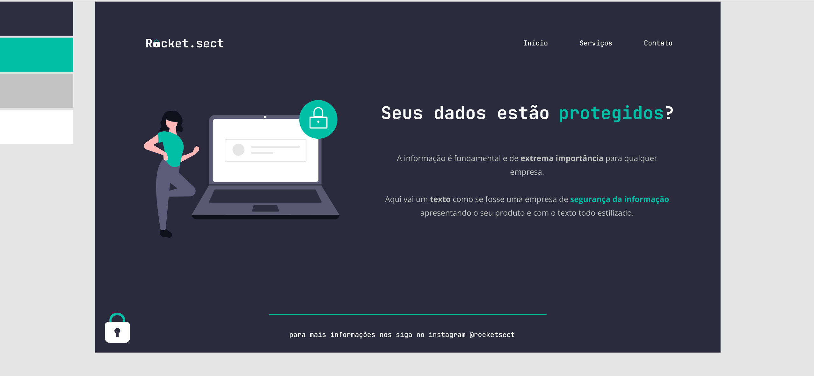

# Desafio avançado - Recriando layout da fase 02
## Avançado 💜💜💜
### Sobre o desafio

Nesse desafio, você deverá recriar uma aplicação, a partir de um layout, para treinar o que aprendeu até agora no Stage 02.

#### Figma da aplicação:
O figma da aplicação está disponível no [link](https://www.figma.com/file/EdKjPWjC8ZlbnH4XzTObv2/Explorer/duplicate)

### Desafio concluído
Código foi feito de maneira que o site ficasse da forma mostrada no [Figma](https://www.figma.com/file/EdKjPWjC8ZlbnH4XzTObv2/Explorer/duplicate) e com boa semâtica.
